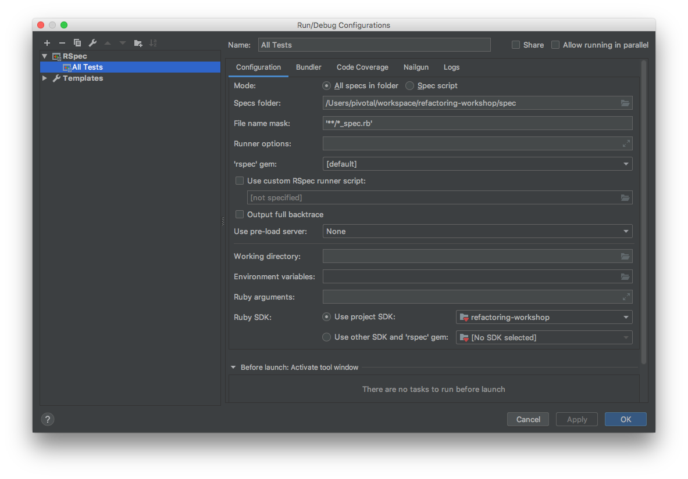

# Facilitator Guide

## Resources

- Slides: see the [slides](slides) folder of this repo.
- Handout: [Summary of Smells and Refactorings](docs/smells/README.md).

## About the Slides

The presentation slides are written in Markdown using
[Remark](https://remarkjs.com/#1). Some tips for using them:

- To show presenter notes and slides on different monitors,
  press `[C]` in the presentation to clone the window, and
  then press `[P]` to switch to presenter mode in one of the
  windows. The clones will stay in sync as you click through
  the slides.

## Before the Workshop

- Study the code smells and refactorings in the in docs/
  folder. Identify the code smell corresponding to each
  TODO comment in `solutions/annotated_autoclop.rb`.
- Practice the presentation. If you like, you can read off
  the speaker notes.
- `git clone` this repository.
- Run `bundle install` to get the dependencies.
- Run `bundle exec rspec spec` to run the tests.
- Open this repository in your IDE.
- To configure RubyMine to run the tests, make a new Run Configuration that looks like this: 

## During the Workshop

- Show the slides in [slides/presentation.html]. The last
  slide shows autoclop.rb open in the RubyMine IDE.
- Say, "Please find as many specific structural
  problems with this code as you can in 15 minutes. Post
  them in the Zoom chat. We'll discuss them as a group when
  everyone is done. Don't worry about translating them to
  code smells yet; we'll do that as a group."
- Hand out printed copies of [autoclop.rb] to local
  participants.
- Send everyone a link to [autoclop.rb on Github](https://github.com/benchristel/refactoring-workshop/blob/master/autoclop.rb).
- `cp solutions/annotated_autoclop.rb autoclop.rb`
- Open [autoclop.rb](autoclop.rb) but do not show it to
  participants. Since you copied it from
  annotated_autoclop.rb, you'll see TODO comments for
  specific problems.
- Monitor the Zoom chat. Add TODO comments for any
  problems people find that aren't yet annotated.
- Remind participants when time is almost up. "You have one
  minute" "finish the thought you're on". If you miss one or
  two issues in the Zoom chat, that's okay.
- Screen-share your IDE.
- Introduce mob-programming. "We're going to fix this code
  together. I'll be typing but basically just taking
  dictation; the ideas will come from all of you."
- For the next hour, repeat the following steps:
  - Ask, "What's the lowest hanging fruit here? What problem
    could we fix easily, right now?"
  - Someone will pick out one of the TODO comments. Name the
    corresponding code smell.
  - Show the slide for that smell.
  - Ask, "How would we refactor to remove this smell?"
  - Once you've gotten answers, show the slide for the
    refactoring.
  - Provide typing-as-a-service for participants to refactor
    the code.
  - Go over the caveats for the smell you just removed.
    Discuss situations when you wouldn't want to remove the
    smell.
- Take a 15-minute break.
- For 45 minutes, continue mob-refactoring.
- Show a finished product
- Show the final slides
- Discussion
   - Do you have a favorite pattern not discussed today?
   - How can your team use this? any obstacles?

## After the Workshop

Send participants the following list of resources referenced
by this workshop:

- Martin Fowler's site [Refactoring.com](https://refactoring.com) and its [catalog of refactorings](https://refactoring.com/catalog/)
- The [CodeSmell](http://wiki.c2.com/?CodeSmell) page on [C2Wiki](http://wiki.c2.com)
- [RefactorLowHangingFruit on C2Wiki](http://wiki.c2.com/?RefactorLowHangingFruit)
- [Refactoring.guru](https://refactoring.guru/)
- [_99 Bottles of OOP_](https://www.sandimetz.com/99bottles) by Sandi Metz and Katrina Owen.
- [SourceMaking.com's list of smells](https://sourcemaking.com/refactoring/smells)
- [The repository for the workshop](https://github.com/benchristel/refactoring-workshop)!

If you think you might facilitate the workshop again, ask
participants for feedback. What would they change about the
workshop? What did they find useful?
